# python_labs

## Лабораторная работа 1

### Задание 1
```python
name = input()
age = int(input())
print('Имя:' + name)
print('Возраст:' + str(age))
print("Привет," + name + "!", " Через год тебе будет " + str(age+1) + ".")
```
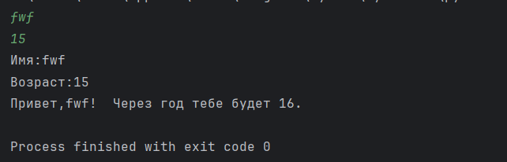

### Задание 2
```python
a = input()
b = float(input())
print("a: " + a.replace('.', ','))
print("b: " + str(b))
print("sum=" + f"{(float(a)+b):.2f}" + ";" + " avg=" + f"{(float(a)+b)/2:.2f}")
```


### Задание 3
```python
price = int(input())
discount = int(input())
vat = int(input())

base = price * (1 - discount/100)
vat_amount = base * (vat/100)
total = base + vat_amount

print("База после скидки: " + f"{base:.2f}" + " ₽")
print("НДС: " + f"{vat_amount:.2f}" + " ₽")
print("Итого к оплате: " + f"{total:.2f}" + " ₽")
```


### Задание 4
```python
m = int(input())
print('Минуты:' + ' ' + str(m))
print(str(m//60) + ":" + f"{(m%60):02d}")
```


### Задание 5
```python
Surname = str(input())
Name = str(input())
Otchestvo = str(input())
print("ФИО: ", Surname, Name, Otchestvo)
print("Инициалы: ", Surname[0] + Name[0] + Otchestvo[0] + '.')
print("Длина (символов): " + str(len(Surname) + len(Name) + len(Otchestvo) + 2))
```


### Задание 6
```python
form = []
tr = fl = 0
for n in range(int(input())):
    data = input().split()

    f = data[0] if len(data) > 0 else ""
    name = data[1] if len(data) > 1 else ""
    age = data[2] if len(data) > 2 else ""
    bol = data[3] if len(data) > 3 else ""

    form.append([f, name, age, bol])
for i in range(len(form)):
    print(str(i+1), form[i][0], form[i][1], form[i][2], form[i][3])
    if form[i][3] == 'True': tr += 1
    else: fl += 1
print("out:", tr, fl)
```


### Задание 7
```python
a = input()
print("in: " + a)
c = []
for i in range(len(a)):
    if a[i].isupper():
        cnt = i
        break
c.append(''.join([a[i] for i in range(cnt, len(a), 3)]))
print("out:", *c)
```


## Лабораторная работа 2

### Задание arrays.py
```python
def min_max(nums: list[float | int]) -> tuple[float | int, float | int]:
    try:
        return tuple([min(nums), max(nums)])
    except ValueError:
        return 'ValueError'


print('----------min_max----------')
print(min_max([1, 2, 3, 4, 5]))
print(min_max([42]))
print(min_max([-5, -2, -9]))
print(min_max([]))
print(min_max([1.5, 2, 2.0, -3.1]))

def unique_sorted(nums: list[float | int]) -> list[float | int]:
    a = sorted(list(set(nums)))
    return a

print('----------unique_sorted----------')
print(unique_sorted([3, 1, 2, 1, 3]))
print(unique_sorted([]))
print(unique_sorted([-1, -1, 0, 2, 2]))
print(unique_sorted([1.0, 1, 2.5, 2.5, 0]))

def flatten(mat: list[list | tuple]) -> list:
    rlist = list()
    for i in range(len(mat)):
        if isinstance(mat[i], list) or isinstance(mat[i], tuple):
            for j in mat[i]:
                rlist.append(j)
        else:
            return 'TypeError'
    return rlist


print('----------flatten----------')
print(flatten([[1, 2], [3, 4]]))
print(flatten(([1, 2], (3, 4, 5))))
print(flatten([[1], [], [2, 3]]))
print(flatten([[1, 2], "ab"]))
```
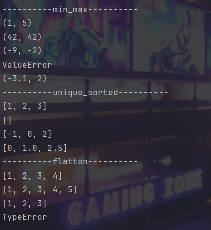

### Задание matrix.py
```python
def transpose(mat: list[list[float | int]]) -> list[list]:
    if not mat:
        return []

    row_len = len(mat[0])
    for row in mat:
        if len(row) != row_len:
            return 'ValueError'

    return [[mat[a][b] for a in range(len(mat))] for b in range(row_len)]


print('----------transpose----------')
print(transpose([[1, 2], [3, 4]]))
print(transpose([[1], [2], [3]]))
print(transpose([[1, 2], [3, 4]]))
print(transpose([]))
print(transpose([[1, 2], [3]]))


def row_sums(mat: list[list[float | int]]) -> list[float]:
    if not mat:
        return []

    row_len = len(mat[0])
    for row in mat:
        if len(row) != row_len:
            return 'ValueError'

    return [sum(i) for i in mat]


print('----------row_sum----------')
print(row_sums([[1, 2, 3], [4, 5, 6]]))
print(row_sums([[-1, 1], [10, -10]]))
print(row_sums([[0, 0], [0, 0]]))
print(row_sums([[1, 2], [3]]))


def col_sums(mat: list[list[float | int]]) -> list[float]:
    if not mat:
        return []

    row_len = len(mat[0])
    for row in mat:
        if len(row) != row_len:
            return 'ValueError'

    mat = transpose(mat)

    return [sum(i) for i in mat]


print('----------col_sums----------')
print(col_sums([[1, 2, 3], [4, 5, 6]]))
print(col_sums([[-1, 1], [10, -10]]))
print(col_sums([[0, 0], [0, 0]]))
print(col_sums([[1, 2], [3]]))
```
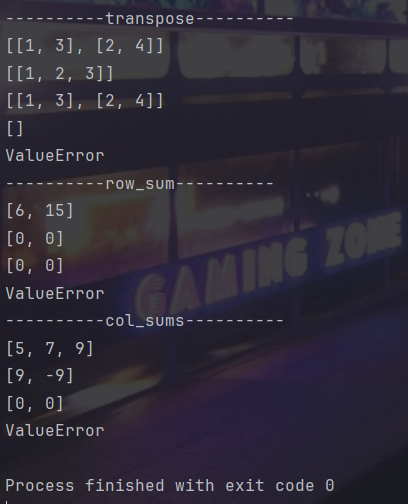

### Задание tuples.py
```python
def info(fio: str, group: str, gpa: float) -> tuple:
    if not isinstance(fio, str):
        raise TypeError("fio должно быть строкой")
    if not isinstance(group, str):
        raise TypeError("group должно быть строкой")
    if not isinstance(gpa, (float, int)):
        raise TypeError("gpa должно быть числом")

    return ((lambda x: f"{x[0].capitalize()} {x[1][0].upper()}.{'' + x[2][0].upper() + '.' if len(x) > 2 else ''}")(
        [a.capitalize() for a in fio.strip().split() if a]), group, f"{gpa:.2f}")


def format_record(rec: tuple[str, str, float]) -> str:
    fio, group, gpa = rec
    inf = info(fio, group, gpa)
    answer = ''
    for _ in inf:
        answer += str(_) + ', '
    return answer[:-2]


print('----------format_record----------')
print(format_record(("Иванов Иван Иванович", "BIVT-25", 4.6)))
print(format_record(("Петров Пётр", "IKBO-12", 5.0)))
print(format_record(("Петров Пётр Петрович", "IKBO-12", 5.0)))
print(format_record(("  сидорова  анна   сергеевна ", "ABB-01", 3.999)))
```
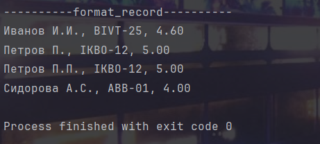

## Лабораторная работа 3

### Задание zadanie A.py
```python
import re
def normalize(text: str, *, casefold: bool = True, yo2e: bool = True) -> str:
    if casefold:
        text = text.casefold()
    if yo2e:
        text = text.replace('ё', 'е')
        text = text.replace('Ё', 'Е')
        text = text.replace('\n', ' ').replace('\r', ' ').replace('\t', ' ')
    while '   ' in text:
        text = text.replace('   ', ' ')
    return text.strip()


def tokenize(text: str) -> list[str]:
    text = text.replace('!', '')
    text = re.split(r'[^\w-]+', text)
    return text


def count_freq(tokens: list[str]) -> dict[str, int]:
    dic = {}
    unique = set(tokens)
    for _ in unique:
        dic[_] = tokens.count(_)
    return dict(sorted(dic.items(), key=lambda x: (-x[1], x[0])))


def top_n(freq: dict[str, int], n: int = 5) -> list[tuple[str, int]]:
    return sorted(freq.items(), key=lambda x: (-x[1], x[0]))[:n]


print('----------normalize----------')
print(normalize("ПрИвЕт\nМИр\t"))
print(normalize("ёжик, Ёлка"))
print(normalize("Hello\r\nWorld"))
print(normalize("  двойные   пробелы  "))
print('----------tokenize----------')
print(tokenize("привет мир"))
print(tokenize("hello,world!!!"))
print(tokenize("по-настоящему круто"))
print(tokenize("2025 год"))
print(tokenize("emoji 😀 не слово"))
print('----------count_freq + top_n----------')
print(count_freq(["a","b","a","c","b","a"]))
print(count_freq(["bb","aa","bb","aa","cc"]))
print(top_n({"a":3,"b":2,"c":1}, n=2))
print(top_n({"aa":2,"bb":2,"cc":1}, n=2))
```
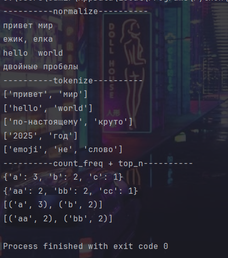

### Задание text_stats.py
```python
import sys
from src.lib import normalize, count_freq, top_n
text = input() # "Привет, мир! Привет!!!"
tokens = []
for word in normalize(text).split():
    clean_word = word.strip('.,!!!!?;:"()[]{}')
    if clean_word:
        tokens.append(clean_word)

total_words = len(tokens)
unique_words = len(count_freq(tokens))
top_words = top_n(count_freq(tokens), 5)
print(f"Всего слов: {total_words}")
print(f"Уникальных слов: {unique_words}")
print("Топ-5:")
for word, count in top_words:
        print(f"{word}:{count}")
```
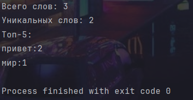

## Лабораторная работа 4

### Задание A.py
```python
from pathlib import Path
import sys

current_dir = Path(__file__).parent# получаем директорию текущего файла
sys.path.append(str(current_dir))# Добавляем эту директорию в путь поиска модулей

from src.lib import tokenize, normalize, top_n, count_freq
from io_txt_csv import read_text, write_csv

def main():
    current_file = Path(__file__)# получаем путь к исполняемому файлу
    print(f"Текущий файл: {current_file}")# кои выводим его

    input_path = current_file.parent / 'data' / 'input.txt'# путь к входному
    output_path = current_file.parent / 'data' / 'output.csv'# путь у выходному

    print(f"Путь к входному файлу: {input_path}")
    print(f"Путь к выходному файлу: {output_path}")
    # создаем директорию и тестовый файл
    input_path.parent.mkdir(parents=True, exist_ok=True)
    input_path.write_text("Привет, мир! Привет!!!", encoding='utf-8')#записываем туда текст
    print(f"Создан/обновлен файл: {input_path}")

    result = read_text(input_path)#читаем текст из файла
    print(f"Результат чтения: {result}")

    normalized_text = normalize(result)#нормализуем его
    print(f"Нормализованный текст: {normalized_text}")

    tokens = tokenize(normalized_text)#разбиваем его
    print(f"Токены: {tokens}")

    frequencies = count_freq(tokens)#считаем частоты
    print(f"Частоты: {frequencies}")

    word_counts = top_n(frequencies, n=len(frequencies))#сортируем частоты по частоте
    print(f"Подсчет слов: {word_counts}")

    write_csv(word_counts, output_path, header=('word', 'count'))#записываем в csv
    print(f"CSV файл создан: {output_path}")

if __name__ == "__main__":
    main()# Запускаем основную функцию при прямом выполнении файла
```
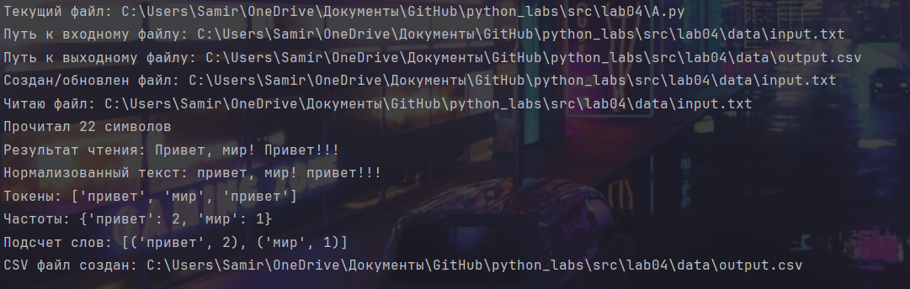

### Задание B.py
```python
from pathlib import Path
from src.lib import tokenize, normalize, top_n, count_freq
from io_txt_csv import read_text, write_csv

current_file = Path(__file__)#создаем обьект path являющийся текущим файлом
input_path = current_file.parent.parent / "src/data/input_test.txt"#строим путь в родительскую директорию и добавляем туда относительный путь
output_path = current_file.parent.parent / "src/data/output.csv"

print(f"Текущий файл: {current_file}")
print(f"Входной файл: {input_path}")
print(f"Выходной файл: {output_path}")

input_path.parent.mkdir(parents=True, exist_ok=True)#создаем директорию для входного файла  если она не существует
if input_path.exists():#проверяем существует ли файл по указанному пути
    input_path.unlink()
input_path.write_text("Привет", encoding="utf-8")#создаем новый файл и записываем туда текст
print(f"Создан пустой файл: {input_path}")

text = read_text(input_path, "utf-8")#читаем файл
print(f"Прочитано: '{text}' ({len(text)} символов)")

normalized_text = normalize(text)#колдуем нашими функциями
tokens = tokenize(normalized_text)
frequencies = count_freq(tokens)

print(f"Токены: {tokens}")
print(f"Частоты: {frequencies}")

word_counts = top_n(frequencies, n=len(frequencies))#получаем отсортированные по частоте слова
write_csv([[word, count] for word, count in word_counts],#подготавливаем слова для записи
          output_path, header=('word', 'count'))#вызываем функцию записи
print(f"CSV создан: {output_path}")

print(f"Всего слов: {sum(frequencies.values())}")
print(f"Уникальных слов: {len(frequencies)}")

print("Топ 5 слов:")
top_5 = top_n(frequencies, n=5)
for i, (word, count) in enumerate(top_5, 1):
    print(f"  {i}. '{word}': {count}") if top_5 else print("  Нет слов")
```
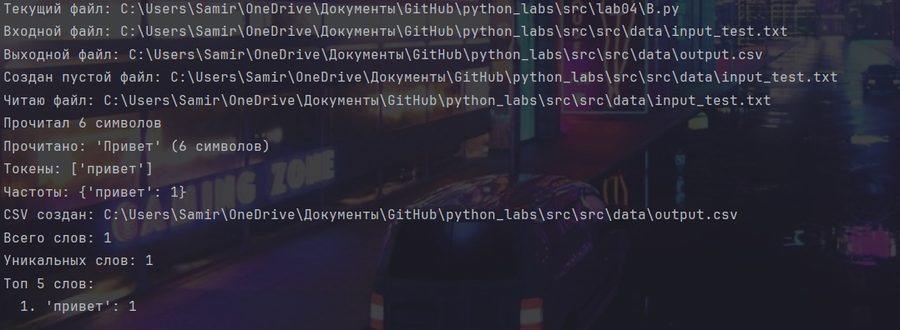

## Лабораторная работа 5

### Задание A
```python
import json
import csv
from pathlib import Path


def json_to_csv(json_path: str, csv_path: str) -> None:
    try:
        with open(json_path, 'r', encoding='utf-8') as json_file:# открываем JSON файл для чтения
            data = json.load(json_file)# кидаем все в data и преобразуем в питоновские объекты

        if not data or not isinstance(data, list):# проверяем на пустоту и список
            raise ValueError

        all_keys = set()#проходимся по всем элементас
        for item in data:#собираем все ключи словарей
            if not isinstance(item, dict):
                raise ValueError
            all_keys.update(item.keys())

        with open(csv_path, 'w', newline='', encoding='utf-8') as csv_file:
            writer = csv.DictWriter(csv_file, fieldnames=all_keys)# создаем writer понимающий структуру словарей
            writer.writeheader()
            for row in data:
                complete_row = {key: row.get(key, "") for key in all_keys}# для каждой строки создаем полный словарь
                writer.writerow(complete_row)

    except FileNotFoundError:
        raise FileNotFoundError


def csv_to_json(csv_path: str, json_path: str) -> None:
    try:
        with open(csv_path, 'r', encoding='utf-8') as csv_file:# открываем CSV файл для чтения
            reader = csv.DictReader(csv_file)# Читаем CSV как список словарей
            data = list(reader)# переделываем в списк
        if not data:
            raise ValueError

        with open(json_path, 'w', encoding='utf-8') as json_file:
            json.dump(data, json_file, ensure_ascii=False, indent=2)#записываем данные в JSON файл в красивом форматировании

    except FileNotFoundError:
        raise FileNotFoundError
```

### Задание B
```python
import csv
from openpyxl import Workbook
from openpyxl.utils import get_column_letter


def csv_to_xlsx(csv_path: str, xlsx_path: str) -> None:
    try:
        wb = Workbook()# создаем новую Excel кнгу
        ws = wb.active# получаем активный лист
        ws.title = "Sheet1"# переименовываем лист

        with open(csv_path, 'r', encoding='utf-8') as csv_file:
            reader = csv.reader(csv_file)# создаем CSV reader
            for row in reader:# читаем острочно
                ws.append(row)# добавляем строку в Excel

        for column_cells in ws.columns:# проходим по каждому столбцу
            length = max(len(str(cell.value or "")) for cell in column_cells)#  находим макс длину текста в столбце
            ws.column_dimensions[column_cells[0].column_letter].width = max(length + 2, 8)# устанавливаем ширину

        wb.save(xlsx_path)# сохраняем Excel файл

    except FileNotFoundError:
        raise FileNotFoundError
```

### Задание test.py
```python
import sys
import os
from pathlib import Path

current_dir = Path(__file__).parents# получаем директорую файла
sys.path.insert(0, str(current_dir))# добавляем директорию в начало пути поиска

from src.lib import json_to_csv, csv_to_json, csv_to_xlsx
Level_up = Path(__file__).parent.parent.parent# поднимаемся на 3 уровня вверх от файла
json_source = Level_up / "data" / "samples" / "ex1.json"# берем и создаем в папке data
csv_source = Level_up / "data" / "samples" / "ex2.csv"
output_csv = Level_up / "data" / "out" / "ex1.csv"
output_json = Level_up / "data" / "out" / "ex2.json"
output_xlsx = Level_up / "data" / "out" / "ex3.xlsx"
try:
    json_to_csv(str(json_source), str(output_csv))# преобразуем в нужные форматы
    csv_to_json(str(csv_source), str(output_json))
    csv_to_xlsx(str(csv_source), str(output_xlsx))
except Exception as x:# сохраняем ошибку в переменную х и выводим
    print(f"Ошибка: {x}")
```
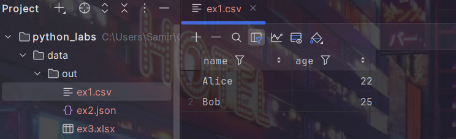
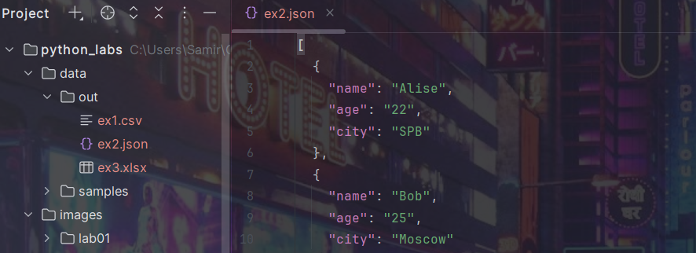
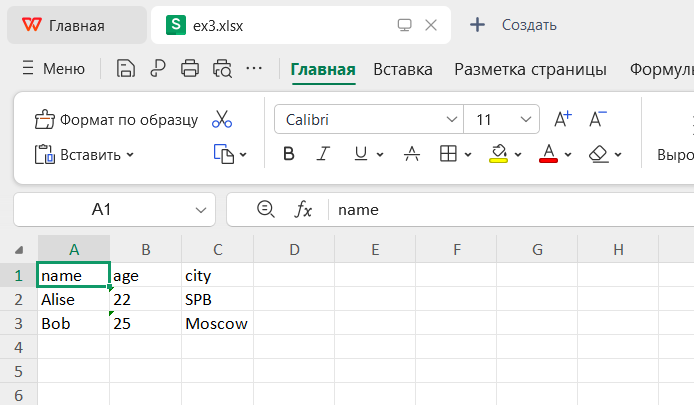

## Лабораторная работа 6

### Задание cli_convert.py
```python
import argparse
from src.lib import json_to_csv, csv_to_json, csv_to_xlsx

def main():
    parser = argparse.ArgumentParser(description="Конвертеры данных")#Создаем основной парсер с описанием "Конвертеры данных"
    sub = parser.add_subparsers(dest="cmd")#Создаем группу подпарсеров для разных команд ,а выбор команды будет сохранен в атрибут cmd


    json_to_csv_p = sub.add_parser("json2csv")#Создаем подпарсер для команды json2csv
    json_to_csv_p.add_argument("--input", dest="input", required=True, help="Входной JSON файл")
    json_to_csv_p.add_argument("--output", dest="output", required=True, help="Выходной CSV файл")

    csv_to_json_p = sub.add_parser("csv2json")#Создаем подпарсер для команды csv2json
    csv_to_json_p.add_argument("--input", dest="input", required=True, help="Входной CSV файл")
    csv_to_json_p.add_argument("--output", dest="output", required=True, help="Выходной JSON файл")

    csv_to_xlsx_p = sub.add_parser("csv2xlsx")#Создаем подпарсер для команды csv2xlsx
    csv_to_xlsx_p.add_argument("--input", dest="input", required=True, help="Входной CSV файл")
    csv_to_xlsx_p.add_argument("--output", dest="output", required=True, help="Выходной XLSX файл")

    args = parser.parse_args()#Парсим аргументы командной строки и сохраняем в объект args

    if args.cmd == "json2csv":
        # py -m src.lab06.cli_convert json2csv --input  data/samples/ex1.json  --output data/out/ex1_from_json.csv
        json_to_csv(json_path=args.input, csv_path=args.output)
    elif  args.cmd == "csv2json":
        #py -m src.lab06.cli_convert csv2json --input data/samples/ex2.csv --output data/out/ex2_from_csv.json
        csv_to_json(csv_path=args.input, json_path=args.output)
    elif args.cmd == "csv2xlsx":
        #py -m src.lab06.cli_convert csv2xlsx --input data/samples/ex2.csv --output data/out/ex2_from_csv.xlsx
        csv_to_xlsx(csv_path=args.input, xlsx_path=args.output)

if __name__ == "__main__":
    main()
```
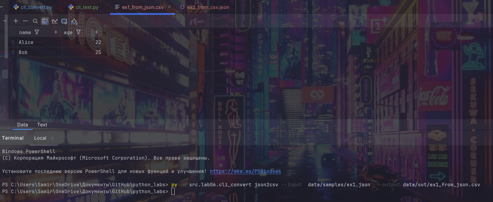
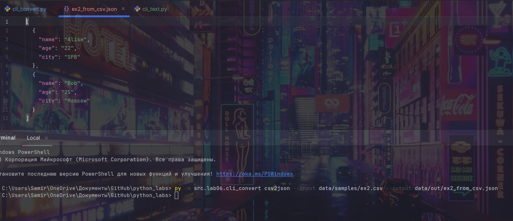
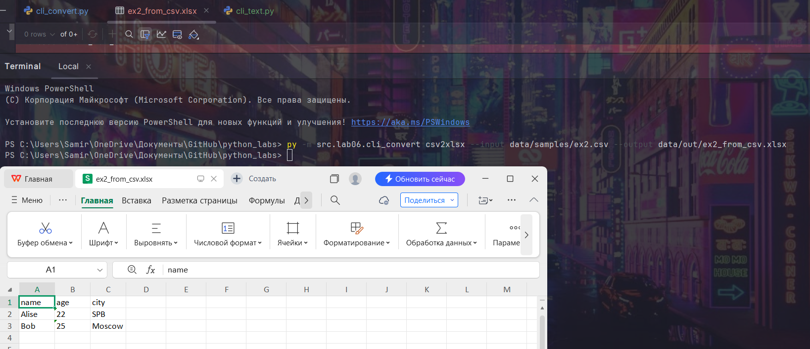

### Задание cli_text.py
```python
import argparse
from pathlib import Path
from src.lib import tokenize, count_freq, top_n


def main():
    parser = argparse.ArgumentParser(description="CLI‑утилиты лабораторной №6")#Создаем парсер с описанием для справки
    subparsers = parser.add_subparsers(dest="command")#Создаем группу подпарсеров для разных команд и выбранная команда сохранится в args.command

    cat_parser = subparsers.add_parser("cat", help="Вывести содержимое файла")
    cat_parser.add_argument("--input", required=True)
    cat_parser.add_argument("-n", action="store_true", help="Нумеровать строки")

    stats_parser = subparsers.add_parser("stats", help="Частоты слов")
    stats_parser.add_argument("--input", required=True)
    stats_parser.add_argument("--top", type=int, default=5)

    args = parser.parse_args()#Парсим аргументы командной строки

    file = Path(args.input)#Создаем объект Path для работы с путём файла

    if not file.exists():#Проверяем существование файла, иначе выбрасывает исключение
        raise FileNotFoundError("Файл не найден")

    if args.command == "cat":
        # py -m src.lab06.cli_text cat --input data/samples/text.txt -n

        with open(file, "r", encoding="utf-8") as f:
            num = 1
            for line in f:
                line = line.rstrip("\n")
                if args.n:
                    print(f"{num}: {line}")
                    num += 1
                else:
                    print(line)

    elif args.command == "stats":
        # py -m src.lab06.cli_text stats --input data/samples/text.txt --top 3

        with open(file, "r", encoding="utf-8") as f:
            data = [row for row in f]
        data = "".join(data)

        tokens = tokenize(data)
        freq = count_freq(tokens)
        top = top_n(freq, args.top)

        print(f"Топ-{args.top} слов в файле '{args.input}':")
        number = 1
        for word, count in top:
            print(f"{number}. '{word}' - {count} раз")
            number += 1


if __name__ == "__main__":
    main()
```
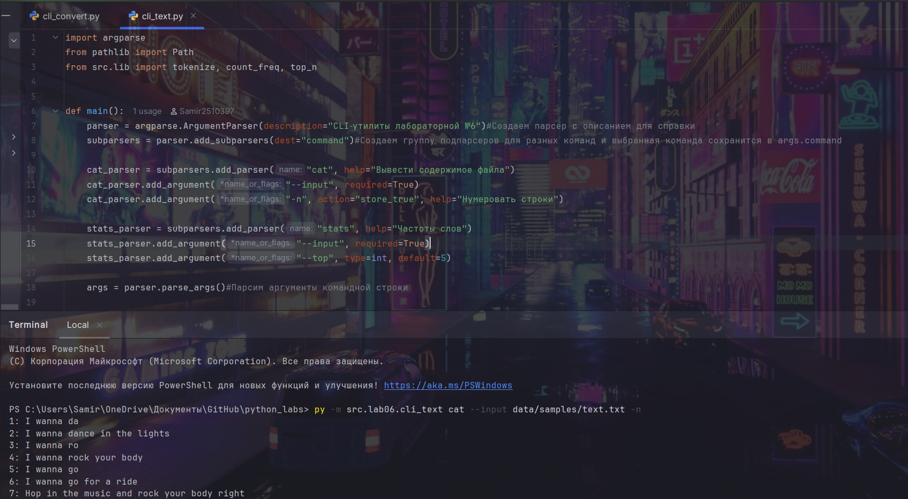


## Лабораторная работа 7

### Задание test_text.py
```python
import pytest
from src.lib import normalize, tokenize, count_freq, top_n

##Параметризуем
@pytest.mark.parametrize(
    "source, expected",
    [
        ("ПрИвЕт\nМИр\t", "привет мир"),
        ("ёжик, Ёлка", "ежик, елка"),
        ("Hello\r\nWorld", "hello  world"),
        ("  двойные   пробелы  ", "двойные пробелы"),
    ],
)
def test_normalize(source, expected):
    assert normalize(source) == expected


@pytest.mark.parametrize(
    "source, expected",
    [
        ("привет мир", ["привет", "мир"]),
        ("hello,world!!!", ["hello", "world"]),
        ("по-настоящему круто", ["по-настоящему", "круто"]),
        ("emoji 😀 не слово", ["emoji", "не", "слово"]),
    ],
)
def test_tokenize(source, expected):
    assert tokenize(source) == expected


@pytest.mark.parametrize(
    "source, expected",
    [
        (["a","b","a","c","b","a"], {"a": 3, "b": 2, "c": 1}),
        (["bb","aa","bb","aa","cc"], {"aa": 2, "bb": 2, "cc": 1}),
    ],
)
def test_count_freq_and_top_n(source, expected):
    assert count_freq(source) == expected


@pytest.mark.parametrize(
    "source, n, expected",
    [
        ({"a":3,"b":2,"c":1}, 2, [('a', 3), ('b', 2)]),
        ({"aa":2,"bb":2,"cc":1}, 2, [('aa', 2), ('bb', 2)]),
    ],
)
def test_top_n(source, n, expected):
    assert top_n(source, n) == expected
```
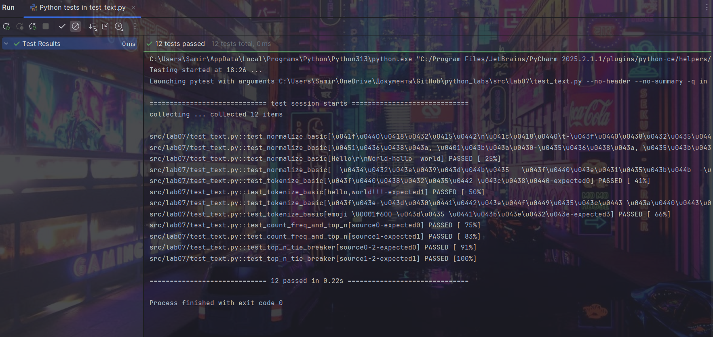

### Задание test_json_csv.py
```python
import pytest
import json, csv
from pathlib import Path
from src.lib import json_to_csv, csv_to_json


##Позитивный сценарий: конвертация JSON → CSV, все совпадает
def test_json_to_csv(tmp_path: Path):
    src = tmp_path / "people.json" #Создаем временные файлы через tmp_path (автоочистка после теста)
    dst = tmp_path / "people.csv"
    json_data = [
        {"name": "Alice", "age": 22},
        {"name": "Bob", "age": 25},
    ]
    src.write_text(json.dumps(json_data, ensure_ascii=False, indent=2), encoding="utf-8")
    json_to_csv(str(src), str(dst))

    with dst.open(encoding="utf-8") as f:
        rows = list(csv.DictReader(f))

    assert len(rows) == 2 #Количество записей (2 строки)
    assert {"name", "age"} <= set(rows[0].keys()) #Наличие нужных колонок (name, age)


##Негативный сценарий: пустой входной файл → ValueError
def test_json_to_csv_empty(tmp_path: Path):
    src = tmp_path / "empty.json"
    dst = tmp_path / "out.csv"
    empty_json_data = []
    src.write_text(json.dumps(empty_json_data), encoding="utf-8")

    with pytest.raises(ValueError):
        json_to_csv(str(src), str(dst))


##Негативный сценари: JSON не список (некорректно записан) → ValueError
def test_json_to_csv_invalid(tmp_path: Path):
    src = tmp_path / "invalid.json"
    dst = tmp_path / "out.csv"
    invalid_json_data = '{"name": "Alice", "age": 22'
    src.write_text(json.dumps(invalid_json_data), encoding="utf-8")

    with pytest.raises(ValueError):
        json_to_csv(str(src), str(dst))


##Позитивный сценарий: конвертация CSV → JSON, все совпадает
def test_csv_to_json(tmp_path: Path):
    src = tmp_path / "people.csv"
    dst = tmp_path / "people.json"
    csv_data = """name,age
Alice,22
Bob,25"""

    src.write_text(csv_data, encoding="utf-8")
    csv_to_json(str(src), str(dst))

    with dst.open(encoding="utf-8") as f:
        result_data = json.load(f)

    assert isinstance(result_data, list) and len(result_data) == 2 #Результат - список, 2 элемента в списке
    assert set(result_data[0]) == {"name", "age"} # Правильные ключи в объектах


##Негативный сценарий: несуществующий путь к файлу → FileNotFoundError
def test_file_error(tmp_path: Path):
    with pytest.raises(FileNotFoundError):
        csv_to_json("nope.csv", "out.json")  # попытка прочитать несуществующий файл

```
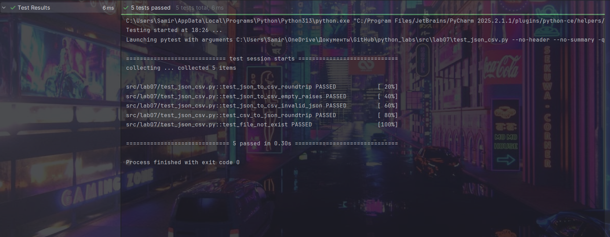


## Лабораторная работа 8

### Задание models.py
```python
from dataclasses import dataclass
from datetime import datetime, date


@dataclass# Генрируем класс с аргументами
class Student:
    FullName: str
    birthdate: str
    group: str
    gpa: float

    def __post_init__(self):#Проверяем дату и балл на корректность
        try:
            datetime.strptime(self.birthdate, "%Y-%m-%d")
        except ValueError:
            raise ValueError(f"Некорректный формат даты: {self.birthdate}, требуется: YYYY-MM-DD")

        if not (0 <= self.gpa <= 5):
            raise ValueError(f"Средний балл должен быть от 0 до 5. Вы ввели: {self.gpa}")

    def age(self) -> int:#Вычисляем возраст
        birth_date = datetime.strptime(self.birthdate, "%Y-%m-%d").date()
        today = date.today()
        age = today.year - birth_date.year

        if (today.month, today.day) < (birth_date.month, birth_date.day):
            age -= 1

        return age

    def to_dict(self) -> dict:#Сереализация
        return {
            "FullName": self.FullName,
            "birthdate": self.birthdate,
            "group": self.group,
            "gpa": self.gpa
        }

    @classmethod
    def from_dict(cls, data: dict):#Десереализация
        return cls(
            FullName=data["FullName"],
            birthdate=data["birthdate"],
            group=data["group"],
            gpa=float(data["gpa"])
        )

    def __str__(self) -> str:#Переделываем все в строки
        return (
            f"{self.FullName}\n"
            f"Дата рождения: {self.birthdate}\n"
            f"Группа: {self.group}\n"
            f"Средний балл: {self.gpa}"
        )


if __name__ == "__main__":
    student = Student("Абдуллин Самир Ниязович", "2007-06-07", "БИВТ-25-3", 5.0)#Создаем с валидацией
    print(student)#Выводим черес строки
    print("=" * 140)#Разделяем

    print(f"Возраст: {student.age()}")

    student_dict = student.to_dict()#Сереализируем в словарь
    print(f"Сериализованный: {student_dict}")

    restored_student = Student.from_dict(student_dict)#Десереализируем в словарь с валидацией
    print(f"Десериализованный: {restored_student}")
```


### Задание serialize.py
```python
import json
from src.lib import Student


def students_to_json(students: list[Student], path: str) -> None:#Преобразуем все в словарь и записываем в json файл
    students_data = [student.to_dict() for student in students]
    with open(path, 'w', encoding='utf-8') as f:
        json.dump(students_data, f, ensure_ascii=False, indent=2)


def students_from_json(path: str) -> list[Student]:#Читаем файл и создаем объекты для каждого словаря, а также обрабатываем ошибки
    try:
        with open(path, 'r', encoding='utf-8') as f:
            students_data = json.load(f)

        students = [Student.from_dict(data) for data in students_data]
        return students
    except FileNotFoundError:
        print(f"Файл {path} не найден")
        return []


def test_serialization():#Тестируем и сохраняем в json файле
    students = students_from_json('data/lab08/lab08_input.json')
    print("\n Загруженные студенты:")
    for student in students:
        print(f"FullName: {student.FullName}, birthdate: {student.birthdate}, group: {student.group}, GPA: {student.gpa}")
    print("\n Сохранение в выходной файл")
    students_to_json(students, 'data/lab08/lab08_output.json')
    print("Файл сохранен: data/lab08/lab08_output.json")


if __name__ == "__main__":
    test_serialization()
```
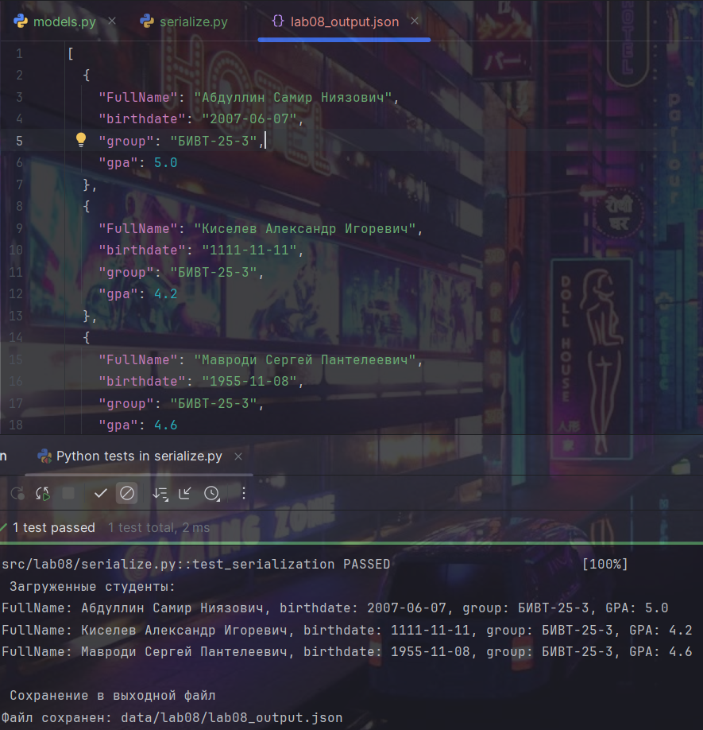


## Лабораторная работа 9

### Задание group.py
```python
import csv
from pathlib import Path
from src.lib import Student, students_from_json
from typing import List

class Group:
    def __init__(self, storage_path: str):
        self.path = Path(storage_path)#преобразуем строку в path
        self.fieldnames = ['FullName', 'birthdate', 'group', 'gpa']# Наши заголовки
        self._ensure_file_exists()#Создаем файл с заголовком

    def _ensure_file_exists(self):
        if not self.path.exists():#Если нет файла
            self.path.parent.mkdir(parents=True, exist_ok=True)#Создаем папки
            with open(self.path, 'w', encoding='utf-8', newline="") as f:
                writer = csv.DictWriter(f, fieldnames=self.fieldnames)
                writer.writeheader()#записываем заголовок

    def read_all(self) -> List[Student]:
        self._ensure_file_exists()
        students = []
        with open(self.path, "r", encoding="utf-8", newline="") as f:
            reader = csv.DictReader(f)#Читаем как словарь
            for row in reader:#Для каждой строки
                students.append(Student.from_dict(row))#Создаем студента
        return students

    def list(self)->list[Student]:#Возвращаем всех студентов
        return self.read_all()

    def add(self, student: Student):#Добавляем нового студента
        self._ensure_file_exists()
        with open(self.path, "a", encoding="utf-8", newline="") as f:
            writer = csv.DictWriter(f, fieldnames=self.fieldnames)
            writer.writerow(student.to_dict())#Добавляем в конец файла

    def find(self, substr:str) -> List[Student]:
        students = self.read_all()#Читаем всех студентов
        l = []#Для результатов
        for st in students:
            if substr.lower() in st.FullName.lower():#проверяем есть ли подстрока в фио
                l.append(st)#Добавляем результаты
        return l

    def remove(self, FullName: str):#Читаем всех
        students = self.read_all()
        new_students = [st for st in students if st.FullName != FullName]#Список без удаляемого студента
        if len(students) != len(new_students):
            with open(self.path, "w", encoding="utf-8", newline="") as f:
                writer = csv.DictWriter(f, fieldnames=self.fieldnames)
                writer.writeheader()#Перезапись заголовка
                for st in new_students:#Записываем всех кроме удаленного
                    writer.writerow(st.to_dict())

    def remove_all(self):
        with open(self.path, "w", encoding="utf-8", newline="") as f:
            writer = csv.DictWriter(f, fieldnames=self.fieldnames)
            writer.writeheader()

    def update(self, FullName: str, **ost):
        students = self.read_all()#читаем все
        flag = False#флаг нахождения студента
        for st in students:
            if st.FullName == FullName:#Если нашли то обновляем
                for key, value in ost.items():
                    if hasattr(st, key):#проверяем есть ли у студента поле
                        setattr(st, key, value)#устанавливаем новое значение
                flag = True
                break
        if flag:#если нашли и обновили
            with open(self.path, "w", encoding="utf-8", newline="") as f:
                writer = csv.DictWriter(f, fieldnames=self.fieldnames)
                writer.writeheader()
                for st in students:#перезаписываем всех студентов
                    writer.writerow(st.to_dict())


students = students_from_json('C:/Users/Samir/OneDrive/Документы/GitHub/python_labs/data/lab08/lab08_input.json')#Читаем файл и создаем объект студент и превращаем его в список
l = Group("test.csv")#создаем файл
l.remove_all()#чистим его
for i in students:#каждого студента добавляем в csv
    l.add(i)
print(*l.list(),sep='\n')#читаем и распаковываем всех
print('='*140)
print(*l.find("ин"),sep='\n')#ищем меня
print('='*140)
l.remove("Киселев Александр Игоревич")#кикаем саню
l.update("Абдуллин Самир Ниязович",birthdate = '2002-03-25',group='tsp-21-1',gpa=3.0)#превращаем меняя в старшекурсника-раздолбая


```
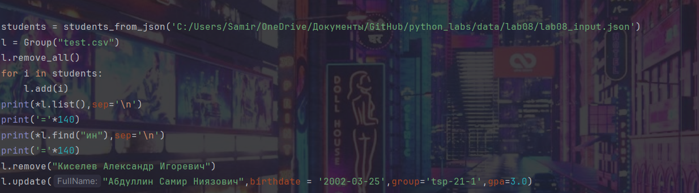
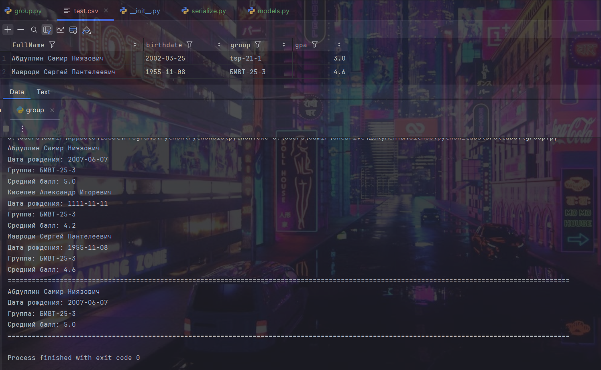


## Лаболаторная работа 10
# Теория
# Стек (англ. stack - «стопка») - абстрактный тип данных, упорядоченный набор элементов. Добавление новых элементов и удаление существующих происходит с одного конца, называемого вершиной стека.
#
# Операции:
#
# push(x) — положить элемент сверху;
# pop() — снять верхний элемент;
# peek() — посмотреть верхний, не снимая.
# Типичные применения:
#
# история действий (undo/redo);
# обход графа/дерева в глубину (DFS);
# парсинг выражений, проверка скобок.
# Очередь (Queue) — это структура данных, которая работает по принципу FIFO (First In, First Out): «первый пришёл — первый вышел». Элементы добавляются в конец очереди и извлекаются из начала.
#
# Операции:
#
# enqueue(x) — добавить в конец;
# dequeue() — взять элемент из начала;
# peek() — посмотреть первый элемент, не удаляя.
# Типичные применения:
#
# обработка задач по очереди (job queue);
# обход графа/дерева в ширину (BFS);
# буферы (сетевые, файловые, очереди сообщений).
# В Python:
#
# обычный list плохо подходит для реализации очереди:
# удаление с начала pop(0) — это O(n) (все элементы сдвигаются);
# collections.deque даёт O(1) операции по краям:
# append / appendleft — O(1);
# pop / popleft — O(1).
# Односвязный список (Singly Linked List) — это линейная и однонаправленная структура данных, в которой данные сохраняются на узлах, и каждый узел связан ссылкой со своим следующим узлом.
#
# Структура:
#
# состоит из узлов Node;
# каждый узел хранит:
# value — значение элемента;
# next — ссылку на следующий узел или None (если это последний).
# Основные идеи:
#
# элементы не хранятся подряд в памяти, как в массиве;
# каждый элемент знает только «следующего соседа».
# Плюсы:
#
# вставка/удаление в начало списка за O(1):
# если есть ссылка на голову (head), достаточно перенаправить одну ссылку;
# при удалении из середины не нужно сдвигать остальные элементы:
# достаточно обновить ссылки узлов;
# удобно использовать как базовый строительный блок для других структур (например, для очередей, стеков, хеш-таблиц с цепочками).
# Минусы:
#
# доступ по индексу i — O(n):
# чтобы добраться до позиции i, нужно пройти i шагов от головы;
# нет быстрого доступа к предыдущему элементу:
# чтобы удалить узел, нужно знать его предыдущий узел → часто нужен дополнительный проход.
# Двусвязный список (Doubly Linked List) — это структура данных, в которой каждый элемент (узел) содержит указатели на предыдущий и следующий элементы списка.
#
# Основные идеи:
#
# можно двигаться как вперёд, так и назад по цепочке узлов;
# удобно хранить ссылки на оба конца: head и tail.
# Плюсы по сравнению с односвязным:
#
# удаление узла по ссылке на него — O(1):
# достаточно «вытащить» его, перенастроив prev.next и next.prev;
# не нужно искать предыдущий узел линейным проходом;
# эффективен для структур, где часто нужно удалять/добавлять элементы в середине, имея на них прямые ссылки (например, реализация LRU-кэша);
# можно легко идти в обе стороны:
# прямой и обратный обход списка.
# Минусы:
#
# узел занимает больше памяти:
# нужно хранить две ссылки (prev, next);
# код более сложный:
# легко забыть обновить одну из ссылок и «сломать» структуру;
# сложнее отлаживать.

### Задание structures.py
```python
from collections import deque


class Stack:#Создаем пустой стек
    def __init__(self):
        self._data = []#пустой список для хранения

    def push(self, item):#добавляем элемент на вершину
        self._data.append(item)

    def pop(self):#удаляем элементы с вершины(без элементов удаляет последний)
        if self.is_empty():
            raise IndexError("Стек пуст, удалять нечего")
        return self._data.pop()

    def peek(self):#показывает эелент вершины без удаления
        if self.is_empty():
            return None
        return self._data[-1]

    def is_empty(self):#проверяем пустоту стека
        return len(self._data) == 0

    def __len__(self):#кол-во элементов в стеке
        return len(self._data)


class Queue:#создаем пустую куешку
    def __init__(self):
        self._data = deque()

    def enqueue(self, item):#добавляем элемент в конец куешки
        self._data.append(item)

    def dequeue(self):#удаляем и выводим элемент из начала куешки
        if self.is_empty():
            return IndexError
        return self._data.popleft()

    def peek(self):#смотрим первый элемент куешки
        if not self._data:
            return None
        return self._data[0]

    def is_empty(self) -> bool:#проверка на пустоту
        return not self._data

    def __len__(self):#кол-во элементов в куешке
        return len(self._data)


if __name__ == '__main__':#проверка
    s = Stack()
    s.push(6)
    s.push(3)
    print(s.pop())
    print(s.peek())
    print(s.__len__())
    print(s.is_empty())
    s.pop()
    print(s.is_empty())

    q = Queue()
    q.enqueue(6)
    q.enqueue(4)
    print(q.dequeue())
    print(q.peek())
    print(q.__len__())
    print(q.is_empty())
    q.dequeue()
    print(q.is_empty())
```
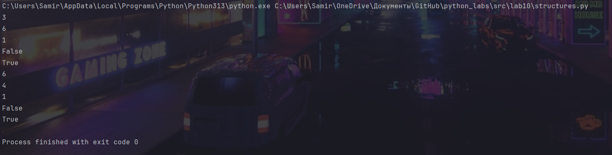

### Задание Linked_list.py
```python
class Node:#узел
    def __init__(self, value, next=None):
        self.value = value #данные узла
        self.next = next #ссылка на след. узел


class SinglyLinkedList:
    def __init__(self):
        self.head = None #указатель первого узла
        self.tail = None #указатель последнего узла
        self._size = 0 # кол-во элементов

    def append(self, value):#добавляем элемент в конец
        new_n = Node(value)# создаем новый узел
        if self.head == None:#если список пуст, новый узел становится и головой и хвостом
            self.head = new_n
            self.tail = new_n
        else:#если не пуст
            self.tail.next = new_n #старых хвост теперь не хвост
            self.tail = new_n # новый узел теперь хвост
        self._size += 1 # увеличиваем размер

    def prepend(self, value):#добавление элемента в начало
        new_n = Node(value)#создаем новый узел
        if self.head == None:
            self.head = new_n
            self.tail = new_n
        new_n.next = self.head#новый узел ссылается на старую голову
        self.head = new_n#новый узел становится головой
        self._size += 1 # увеличиваем размер

    def insert(self, idx: int, value):#вставка по индексу
        if idx < 0 or idx > self._size:# проверка индекса
            raise IndexError
        new_n = Node(value)
        if idx == 0:#вставка в начало
            new_n.next = self.head
            self.head = new_n
            self._size += 1
            return
        if idx == self._size:#вставка в конец
            self.tail.next = new_n
            self.tail = new_n
            self._size += 1
            return
        c = 0 #вставка в середину
        prev = None
        curr = self.head
        while curr != None:
            if c == idx:
                prev.next = new_n
                new_n.next = curr

                break
            prev = curr
            curr = curr.next
            c += 1

        self._size += 1 #увеличиваем размер

    def remove_at(self, idx: int):#удаление по индексу
        if idx < 0 or idx >= self._size:#проверка индекса
            raise IndexError
        if idx == 0:#удаление головы
            self.head = self.head.next
            self._size -= 1
            return

        curr = self.head#удаление середины и конца
        for i in range(idx-1):
            curr = curr.next

        value = self.head.value

        if curr.next == self.tail:#удаление конца
            self.tail = curr

        curr.next = curr.next.next
        self._size -= 1
        return


    def __iter__(self):#итератор
        curr = self.head
        while curr != None:
            yield curr.value
            curr = curr.next

    def __len__(self):
        return self._size

    def __repr__(self):#строковое представление для вывода
        return f"SinglyLinkedList({list(self)})"


# test SinglyLinkedList
sll = SinglyLinkedList()
print(f"1. Пустой список: {sll}")
sll.append(7)
sll.append(8)
sll.append(10)
sll.append(20)
sll.append(30)
print(f"2. Добавление в конец (10, 20, 30): {sll}")
sll.prepend(5)
print(f"3. Добавление в начало (5): {sll}")
sll.insert(2, 15)
print(f"4. Вставка 15 по индексу 2: {sll}")
sll.insert(0, 1)
print(f"5. Вставка 1 по индексу 0: {sll}")
sll.insert(8, 100)
print(f"6. Вставка 100 в конец: {sll}")
sll.remove_at(4)
print(f"7. Удаление 8 (середина): {sll}")
sll.remove_at(0)
print(f"8. Удаление 1 (голова): {sll}")
sll.remove_at(6)
print(f"9. Удаление 100 (хвост): {sll}")
print(f"10. Размер: {len(sll)}")
print(f"11. Пуст ли список? {len(sll) == 0}")
```
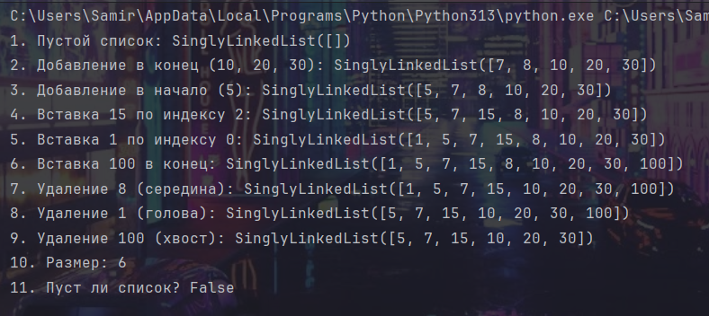


