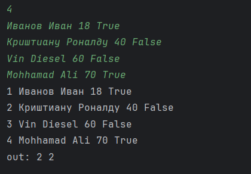

# python_labs
# P-O-R-SH-E  9-1-1

## Лабораторная работа 1

### Задание 1
```python
name = input()
age = int(input())
print('Имя:' + name)
print('Возраст:' + str(age))
print("Привет," + name + "!", " Через год тебе будет " + str(age+1) + ".")
```


### Задание 2
```python
a = input()
b = float(input())
print("a: " + a.replace('.', ','))
print("b: " + str(b))
print("sum=" + f"{(float(a)+b):.2f}" + ";" + " avg=" + f"{(float(a)+b)/2:.2f}")
```


### Задание 3
```python
price = int(input())
discount = int(input())
vat = int(input())

base = price * (1 - discount/100)
vat_amount = base * (vat/100)
total = base + vat_amount

print("База после скидки: " + f"{base:.2f}" + " ₽")
print("НДС: " + f"{vat_amount:.2f}" + " ₽")
print("Итого к оплате: " + f"{total:.2f}" + " ₽")
```


### Задание 4
```python
m = int(input())
print('Минуты:' + ' ' + str(m))
print(str(m//60) + ":" + f"{(m%60):02d}")
```


### Задание 5
```python
Surname = str(input())
Name = str(input())
Otchestvo = str(input())
print("ФИО: ", Surname, Name, Otchestvo)
print("Инициалы: ", Surname[0] + Name[0] + Otchestvo[0] + '.')
print("Длина (символов): " + str(len(Surname) + len(Name) + len(Otchestvo) + 2))
```


### Задание 6
```python
form = []
tr = fl = 0
for n in range(int(input())):
    data = input().split()

    f = data[0] if len(data) > 0 else ""
    name = data[1] if len(data) > 1 else ""
    age = data[2] if len(data) > 2 else ""
    bol = data[3] if len(data) > 3 else ""

    form.append([f, name, age, bol])
for i in range(len(form)):
    print(str(i+1), form[i][0], form[i][1], form[i][2], form[i][3])
    if form[i][3] == 'True': tr += 1
    else: fl += 1
print("out:", tr, fl)
```


### Задание 7
```python
a = input()
print("in: " + a)
c = []
for i in range(len(a)):
    if a[i].isupper():
        cnt = i
        break
c.append(''.join([a[i] for i in range(cnt, len(a), 3)]))
print("out:", *c)
```

